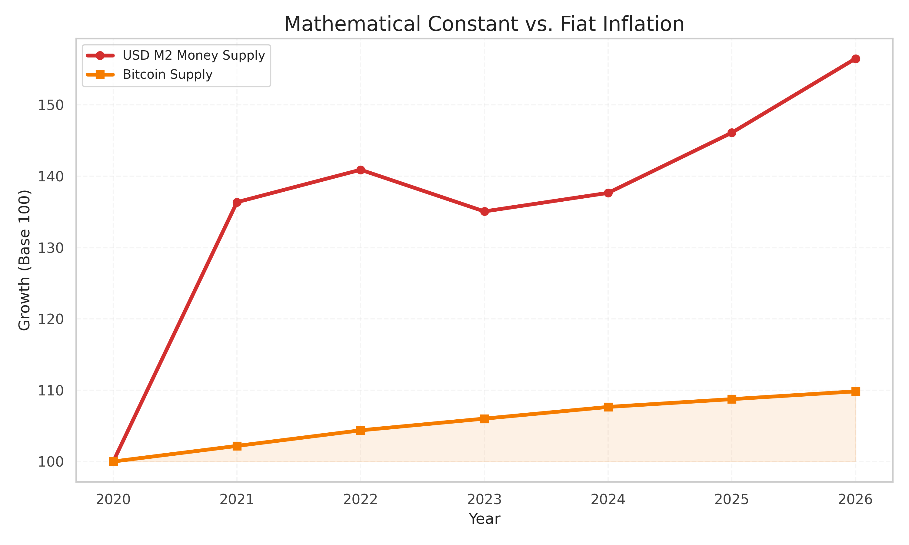
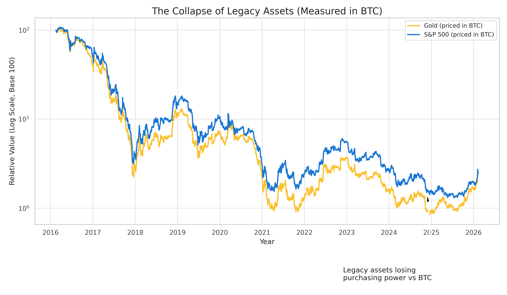
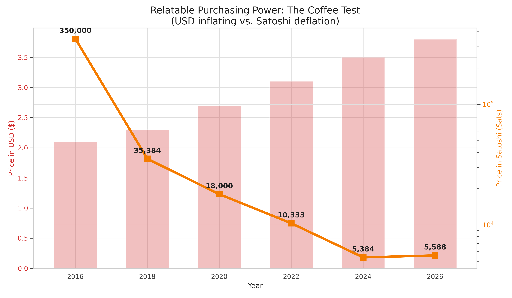
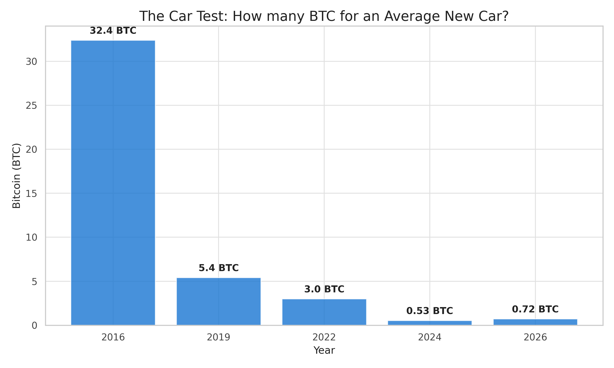
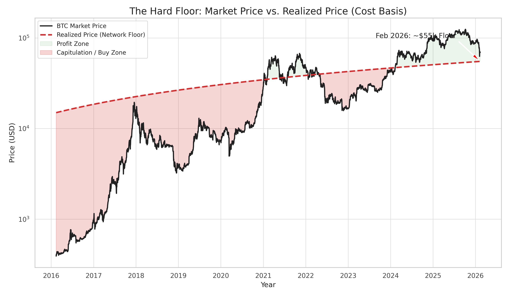
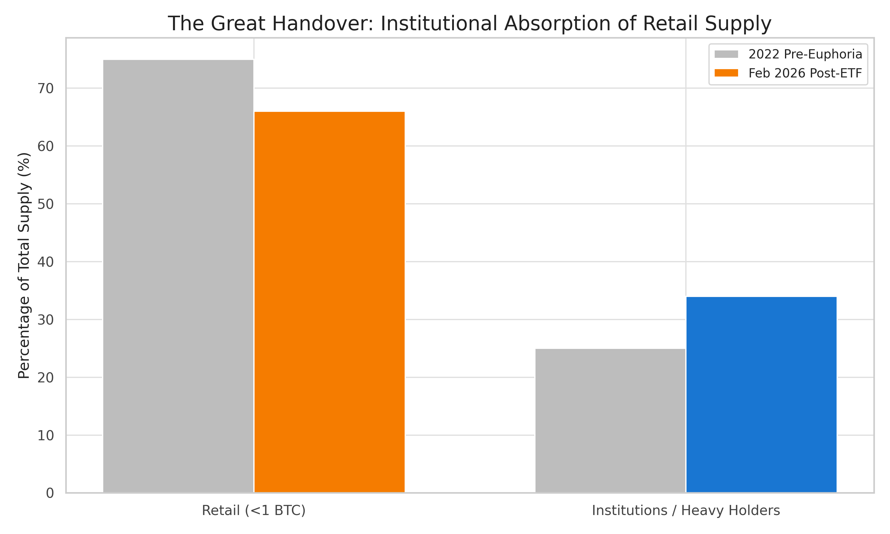

## The Bitcoin Constant: Why the "Crash" is a Legacy Failing

**TLDR:** Bitcoin isn't just a currency; it is a **mathematical constant** in a world of "rubber rulers." While the 2026 crash dominates headlines, it is merely a liquidity event in a failing legacy system. When measured against the 21-million hard cap, the world reveals its true nature: human productivity is making things cheaper, but inflation is hiding the gain. 

> Bitcoin isn't crashing; the legacy financial system is failing to keep pace with the truth of math. 

---

The headlines in early 2026 are predictable: *"Bitcoin Crashes as Liquidity Dries Up,"* *"The Crypto Winter is Here."* To the casual observer, Bitcoin’s drop from its $126,000 peak in October 2025 to roughly $68k today looks like a failure of the asset. 

However, professional market analysis tells a different story. This is not a Bitcoin failure; it is a **Liquidity Event** triggered by the legacy financial system's inability to handle structural shifts. 

### The Rational Reason for the "Crash"
The current volatility is not random. It is driven by three distinct factors:
1. **The Tactical Liquidity Drain:** As seen in the recent U.S. debt shifts and tariff-driven "liquidity shocks," capital is being pulled from all risk assets to cover positions elsewhere.
2. **The "Trump Pump" Normalization:** The euphoria following the 2025 election led to over-leveraged positions. We are now seeing the "dump" phase of that cycle as the market deleverages.
3. **The 4-Year Halving Cycle:** History repeats. We are roughly 22 months post-halving (April 2024), a period historically associated with deep corrections and "crypto winters" before the next structural leg up.

### The Physics of Finance: The 21 Million Constant
In the world of physics, bridges stay standing because we have constants. A meter is always a meter; a kilogram is always a kilogram. Without these fixed measurements, the physical world would be chaos.

The financial system, however, has no meter. The USD, EUR, and JPY are rubber rulers - they stretch and shrink at the whim of central bank policy. **Bitcoin is the first and only financial asset that brings a math constant into the system.**

* **The Hard Cap:** Exactly 21,000,000 BTC. Not a satoshi more.
* **The predictable supply:** Unlike the USD M2 supply, which has inflated by over 40% since 2020, Bitcoin’s supply curve is written in code, not committee.

> **The Stability Gap:** While the USD money supply continues its volatile expansion, Bitcoin’s supply remains a flat, predictable constant - acting as the "meter" of the new financial era.

### Measuring the "Weakness"
The shocking reality emerges when you stop measuring Bitcoin in USD and start measuring **Legacy Assets in Bitcoin.**

Traditional media says Bitcoin is weak. But look at the S&P 500 or Gold when priced in the "Bitcoin Constant." Since 2021, even as Gold hits record USD highs ($5,600/oz in Feb 2026), its value **relative to Bitcoin** has been in a structural collapse.

> **The Great Devaluation:** When measured in a fixed constant (BTC) rather than a devaluing currency (USD), legacy assets like the S&P 500 and Gold reveal their true loss of purchasing power over the last five years.

### The Purchasing Power Reality
A major challenge with traditional currencies is that they fail at their primary job: **storing value**. While Bitcoin's price fluctuates, its long-term ability to command real-world goods reveals the structural strength of a fixed mathematical supply.

#### 1. The Coffee Test (Daily Goods)
Consider a daily staple like a cup of coffee. In 2016, an average cup cost ~$2.10. By early 2026, that same cup costs ~$3.80 - a steady drain on human labor. 

But look at the price in the "Bitcoin Constant." In 2016, a coffee cost over **350,000 Satoshi**. Today, despite the "crash," it costs fewer than **6,000 Satoshi**. The item hasn't changed; the ruler you use to measure it has.

> **The Real-World Flip:** While the USD price of coffee creeps upward due to inflation, the Satoshi price has collapsed by over 98%. Bitcoin is the only asset that makes the world "cheaper" over time for its holders.

#### 2. The Car Test (Major Purchases)
For larger purchases like an average new car, the trend is even more stark. Inflation has pushed car prices from ~$31k in 2016 to nearly ~$50k in 2026.

> **Structural Devaluation:** In 2016, you needed over 32 BTC to buy a new car. Today, you need less than 1 BTC. Bitcoin's long-term utility as a "Financial Meter" becomes undeniable when measured against tangible assets rather than paper promises.

#### The Ideal World: Why Things *Should* Get Cheaper
In a world driven by technological advancement and increasing productivity, things should naturally become cheaper over time. Efficiency gains in manufacturing, energy, and AI mean that it takes less human effort today to produce a smartphone or a car than it did ten years ago. 

The reason we don't see this in our everyday lives is **Inflation**. The traditional financial system intentionally devalues the currency to counteract this natural productivity gain, making life feel increasingly expensive. Bitcoin proves the "Ideal World" hypothesis: it is a system where the benefits of human progress are reflected in a lower cost of living, rather than being eaten away by an expanding money supply.

### The Hard Floor: Why Bitcoin Can't Go to Zero
A common question in times of high volatility is whether Bitcoin could eventually drop to zero. While price fluctuations are extreme, the underlying on-chain data suggests a structural "floor" that is moving steadily upward.

#### 1. The Realized Price (The Network's Cost Basis)
Unlike traditional stocks, we can see exactly what the market "paid" for all Bitcoin in circulation. This is the **Realized Price**. 
* As of early February 2026, the aggregate Realized Price sits at approximately **$55,207**. 
* For long-term holders (those who have held for >155 days), the floor is even more robust at roughly **$40,260**.

> **The Support Zone:** Historically, Bitcoin rarely dips below its realized price for long. This level represents the collective cost basis of the entire network.

#### 2. The Institutional Handover (2022-2026)
One of the most interesting dynamics of this cycle is the "Market Handover." The people blaming Bitcoin for the crash are often the individual retail investors who jumped in late (post-2022 euphoria). 
* **Institutional Conviction**: Between 2024 and early 2026, institutions (BlackRock, Fidelity, and corporate treasuries) surged their holdings to **24%** of the total supply.
* **Retail Capitulation**: In contrast, retail "weak hands" net sold **247,000 BTC** in 2025 alone. On February 5, 2026 - the peak of the recent panic - retail investors realized a record **$3.2 billion in losses** in a single day.

> **The Distribution Shift:** Sophisticated institutional capital is absorbing supply from panicked retail traders, increasing the asset's structural stability over the long term.

The math is simple: sophisticated institutional players are absorbing the supply from panicked retail traders. This shift from speculative "paper hands" to long-term "diamond hands" increases the asset's structural stability over time.

#### 3. The 0.3% Probability
Yale economists Alec Tsyvinski and Yukun Liu performed a exhaustive study on Bitcoin's probability of total collapse. Their findings? For a risk-neutral investor, the probability of Bitcoin going to zero is only **0.3%**. To put that in perspective, many "reputable" fiat currencies and traditional banks carry significantly higher systemic risk over a 100-year horizon.

### Conclusion: The Return to Financial Physics
We are currently enduring a "crypto winter" not because Bitcoin has failed, but because the legacy financial system is undergoing a violent deleveraging. For those who entered the market after the 2022-2024 hype, the current volatility feels like a failure. For the institutions now holding 24% of the supply, it is a structural handover from "paper hands" to "diamond hands."

Bitcoin remains the only asset providing a stable anchor - a **Financial Meter** that allows us to see the world as it should be. It proves that in an ideal world, human progress and AI productivity should make life **cheaper**, not more expensive. 

The question is no longer whether Bitcoin will survive the crash. The question is how much longer the legacy system can survive its lack of constants. Those who blame Bitcoin today are often the same ones who will eventually look back and say: *"I missed the return to financial physics when the truth was most visible."*
