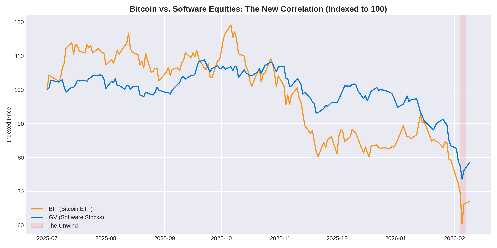
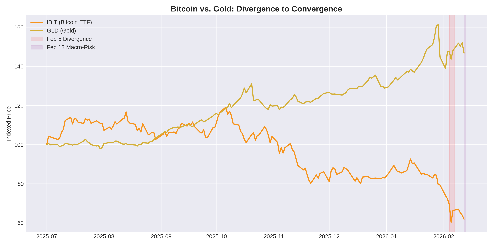
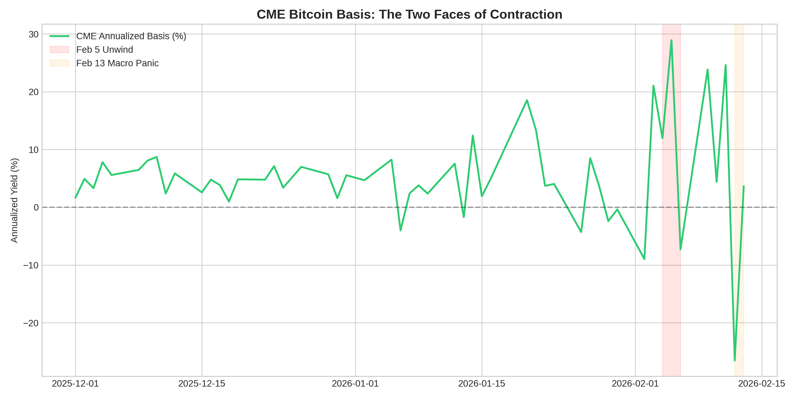
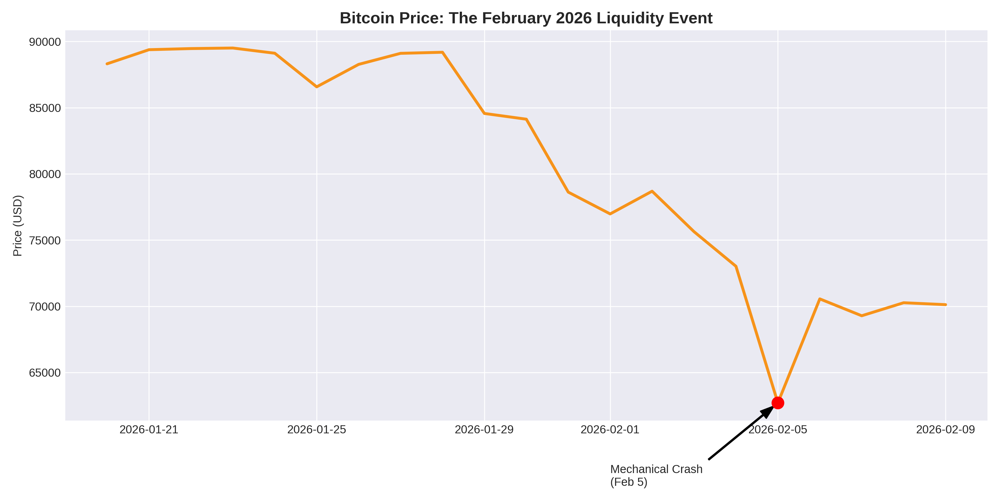
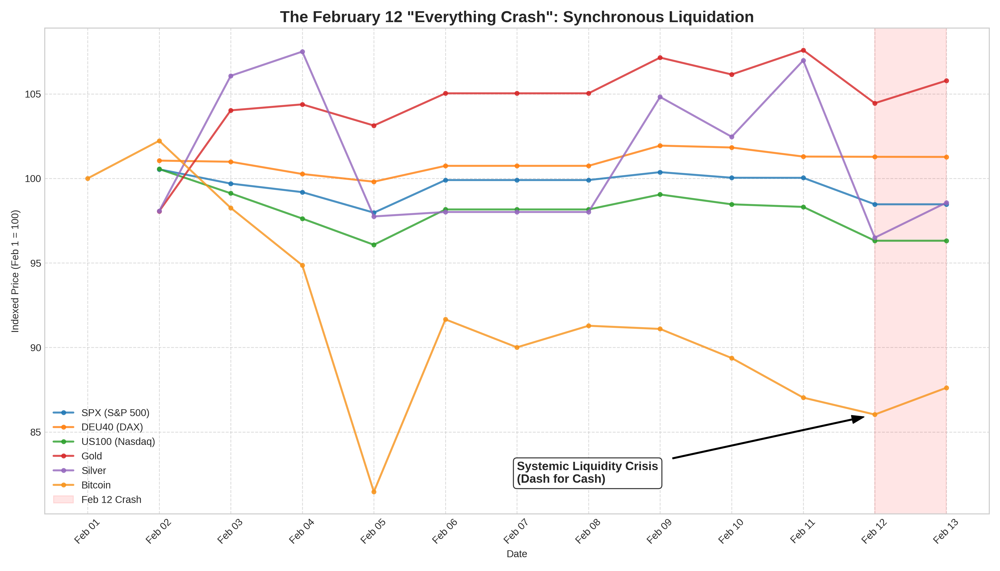
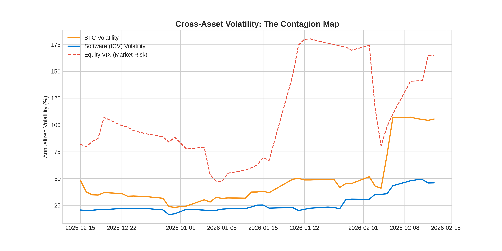

# The Bitcoin "Plumbing" Crash: A Tale of Two Liquidations

**TL;DR:** February 2026 delivered a brutal "double-dip" lesson in market structure. On **Feb 5**, Bitcoin crashed 13% due to a **Mechanical Plumbing** failure—a cascaded unwind of basis trades and dealer delta-hedging. On **Feb 12**, a second systemic crash hit, but this time it was a **"Dash for Cash"** liquidity crisis that simultaneously wiped out SPX, DAX, Gold, Silver, and Bitcoin. To survive the 2026 regime, one must distinguish between Wall Street's pipe-bursts and systemic liquidity drains.

---

## 1. The Correlation Trap: The Double-Dip Reality

As Bitcoin became a staple in institutional portfolios via ETFs (like BlackRock's IBIT), its "uncorrelated" status vanished. Analysis of the early Feb data shows Bitcoin moving in lockstep with tech equities during both liquidity events.

*Chart 1: The "Double-Dip" correlation between IBIT and Software Stocks (IGV) during the Feb 5 and Feb 12 liquidations.*

### Divergence to Convergence: The Gold Signal
On **Feb 5**, Bitcoin fell while Gold held steady, proving the crash was internal to institutional "plumbing." However, on **Feb 12 (Thursday)**, Bitcoin, Gold, and Silver crashed **together** alongside the SPX and DAX. This convergence signaled a true systemic liquidity drain where everything was sold for USD.

*Chart 2: Feb 5 (Mechanical Divergence) vs Feb 12 (Systemic Convergence).*

## 2. The Accelerants: The Mechanical Pipe-Burst (Feb 5)

The initial Feb 5 crash was a "Plumbing" event. As captured by the **Annualized CME Basis**, institutional arbitrage trades were forcibly unwound by risk managers, spiking the basis and triggering dealer tripwires.

*Chart 3: The basis collapse (Unwind) on Feb 5 vs. the systemic adjustment on Feb 12.*

### The Dealer Tripwire & Gamma Squeeze
When Bitcoin breached the $43.60 (IBIT) barrier, dealers were mathematically forced to sell spot to stay hedged. This "Short Gamma" zone accelerated the slide through Feb 5.

*Chart 4: Mapping the two distinct crashes: The Feb 5 Mechanical Slide vs. the Feb 12 Systemic Dip.*

## 3. The "Everything Crash": Dash for Cash (Feb 12)

By the second week of February, the narrative shifted from plumbing to a systemic liquidity crisis. On **Thursday, Feb 12**, any remaining "Digital Gold" or "Safe Haven" narratives were crushed. As financial stress surged, investors liquidated everything—SPX, DAX, US100, Gold, Silver, and Bitcoin—to meet margin calls and raise cash.

*Chart 5: The "Everything Crash": Synchronous liquidation across Equities, Metals, and Bitcoin.*

## 4. The Volatility Contagion Map

The rolling volatility analysis confirms that Bitcoin is now a "Macro Risk Proxy." In both February crashes, BTC volatility spiked in synchronization with equity risk (VIX) and software volatility.

*Chart 6: BTC Volatility (Orange) tracking with Software (Blue) and VIX (White).*

## Conclusion: The New Market Regime

The February 2026 crashes define the new institutional reality. Bitcoin is no longer at the mercy of just crypto retail sentiment; it is now a critical component of the global liquidity cycle. 

1.  **Feb 5** taught us that Wall Street's plumbing can break Bitcoin.
2.  **Feb 12** taught us that in a systemic liquidity crisis, Bitcoin is sold first and fastest alongside every other major asset.

To navigate this landscape, analysts must look past the halving cycles and focus on the interaction of basis spreads, dealer gamma, and systemic liquidity indicators.

---

### Sources
- **Institutional Positioning:** CME Group Basis Analysis (Feb 2026).
- **Macro Analysis:** "Dash for Cash" liquidity crisis (Feb 12, 2026).
- **Market Data:** Yahoo Finance (IBIT, IGV, GLD, BTC-USD, ^VIX, ^GSPC, ^GDAXI, GC=F, SI=F).
- **Research Credits:** Anchorage Digital, Bitwise, 10x Research reports.
