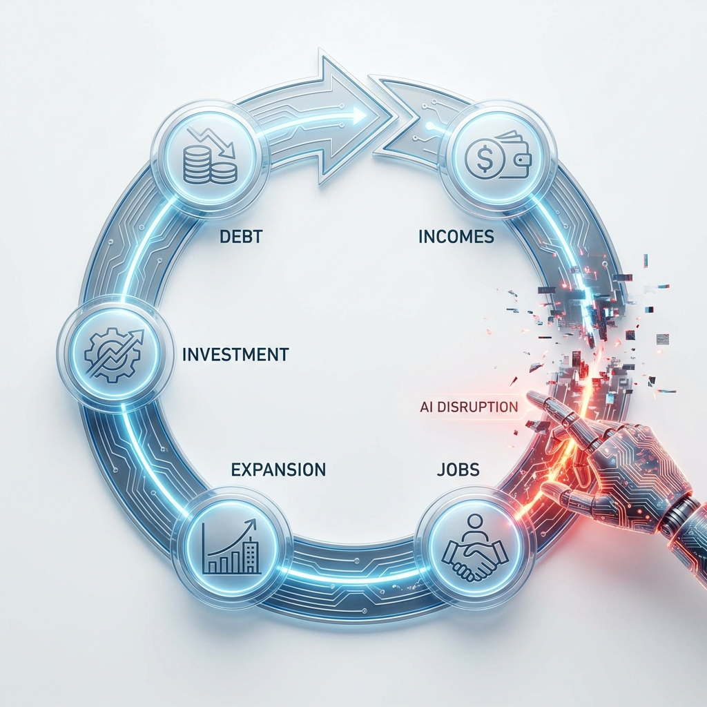

## The Great Paradox of 2026: When Debt Met Disruption

**TLDR:** The global economy's long-standing debt-based system, which relies on continuous growth and an expanding workforce, is clashing head-on with the rapid rise of AI. While AI promises unprecedented efficiency, it also threatens the human income base required to service colossal debts. This paradox is prompting a global shift from "paper promises" to "hard assets," reshaping the geopolitical landscape and fragmenting the world order.

---

For the better part of a century, the global economic engine has run on a fundamental principle: **debt-fueled growth.** Rooted in Keynesian theory, this system operates on the assumption that borrowing money for investment leads to economic expansion, job creation, rising incomes, and ultimately, the capacity to service ever-increasing levels of debt. Critical to this model are two pillars: low, stable interest rates to encourage borrowing, and a continuously expanding global workforce whose productivity and consumption fuel the cycle.

However, as we navigate 2026, this established framework faces an unprecedented challenge: **the advent of Artificial Intelligence.** The very technology poised to redefine productivity and economic output is also threatening the foundational assumption of a growing, debt-servicing human workforce. This is the "Great Paradox" - a system designed for human expansion confronting a future potentially defined by human redundancy.

> The Traditional Debt Flywheel: A self-reinforcing cycle of debt, investment, and human-driven growth, now facing structural disruption by AI.

### The Debt-Based Engine: 80 Years of Leverage

Since the post-WWII era, the global economy has been characterized by an increasing reliance on leverage. Governments borrow to fund public services and infrastructure, corporations borrow to invest and return capital to shareholders, and individuals borrow to consume and acquire assets. This mechanism thrives when interest rates are low, making debt affordable and encouraging its proliferation throughout the system.

The underlying premise is simple: borrowed money is invested, generating returns that exceed the cost of borrowing. This profit then fuels further growth, creating more jobs, higher incomes, and ultimately, more tax revenue to support the national balance sheet. For decades, this virtuous cycle has underpinned global prosperity, with consistently rising asset values and a seemingly endless capacity for expansion.

### AI's Disruptive Force: The Future of Work in Question

The rise of AI, particularly advanced large language models (LLMs) and robotic process automation, is introducing a seismic shift to this equation. As the CEO of Anthropic recently stated, **AI is projected to disrupt up to 50% of entry-level white-collar jobs within the next 1 to 5 years.**

The paradox is clearest when looking at which labor models currently pay into the debt system. High-income, white-collar roles are the primary tax/debt engines, yet they are the most exposed to automation:
* **White-Collar Exposure:** Approximately **60%** of jobs in Advanced Economies (U.S., UK, Switzerland) are highly exposed to AI.
* **Emerging Economy Exposure:** Only ~**26%** remain safe for now, as they rely more on physical or informal labor that AI hasn't mastered.

> The Paradox Result: The very countries burdened with the highest debt are also those facing the greatest workforce displacement from AI.

This poses a critical question for the debt-based system: **If a significant portion of the workforce is displaced, who will generate the future income necessary to service the $38 trillion U.S. debt?** The expansionary model requires an expanding human income base - a premise AI directly challenges.

### Market Divergence: Investors are Voting with Their Feet

The financial markets have already split into two worlds. Investors are no longer betting on broad human-based growth but on machine-driven efficiency. This created a "K-shaped" recovery where traditional sectors lag significantly behind the vanguard of tech.
* **The AI Leaders:** Have outperformed the S&P 500 by over **136%** in the last five years.
* **The Traditional Sectors:** Sectors relying on large human workforces are seeing their valuations stagnate as they struggle to adapt to the new paradigm.

> Investors have already chosen their side: The market has fundamentally split between high-efficiency AI leaders and stagnant traditional engines.

### Geopolitical Repercussions: A World Re-evaluating "Money"

The implications of this paradox are reshaping global financial strategies. Nations are moving away from "paper promises" (debt) and toward "safe haven" hardware and physical assets.

* **China's Structural Exit:** China’s retreat from the U.S. debt system is a long-term strategic slide. Holdings have dropped from a **2013 peak of $1.32 Trillion** to just **$682 Billion** in early 2026 - a nearly 50% reduction.

> A structural retreat from the dollar: China’s aggressive reduction in U.S. debt holdings underscores a multi-year pivot away from the traditional financial system.

* **The Safe-Haven Flip:** For the first time since 1996, central banks hold a higher value of **Gold** than **U.S. Treasuries**.
    * **U.S. Treasuries Share:** Dropped from over 30% in the 2010s to roughly **23%**.
    * **Gold Share:** Rose to **27%**, with total central bank gold value hitting **$4.6 trillion**.

> The ultimate de-risking: Global central banks now hold more value in physical gold than in U.S. Treasuries, signaling a loss of faith in paper promises.

* **Alternative Assets:** Cryptocurrencies like Bitcoin are increasingly viewed as a "debasement hedge," reflecting a growing desire for assets outside the control of traditional financial systems prone to inflationary pressures.

### Conclusion: Upgrading the Engine, Leaking the Fuel

The Great Paradox of 2026 suggests that the system is trying to **"upgrade its engine" (AI) while its "fuel tank" (debt/human labor) is leaking.** Trust in paper promises is falling, while trust in physical assets and machine efficiency is rising. 

The collision of an expansionary, debt-based system with the disruptive potential of AI marks the dawn of a new, fragmented world order. The very definition of wealth and economic stability is being rewritten, moving away from centralized debt and toward tangible, sovereign security.

---

🔗 [LinkedIn Article](https://www.linkedin.com/feed/update/urn:li:activity:7426982951067840512/)
🔗 [Medium Article](https://medium.com/@christonomous/the-great-paradox-of-2026-when-debt-met-disruption-81b323004b94)
