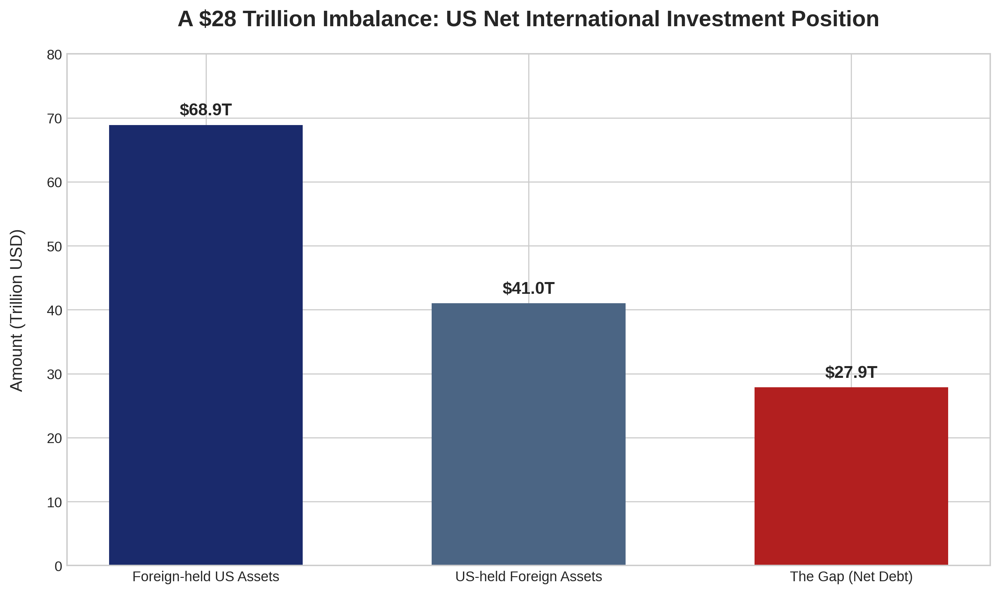
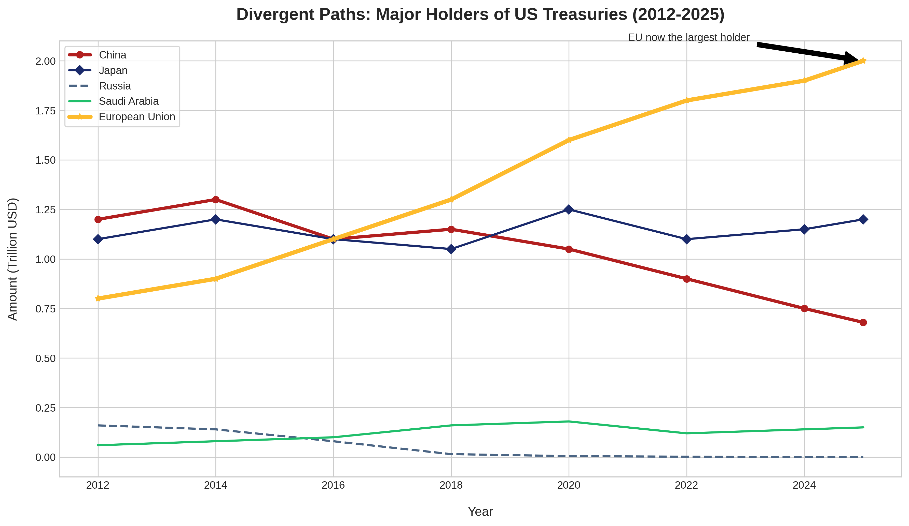
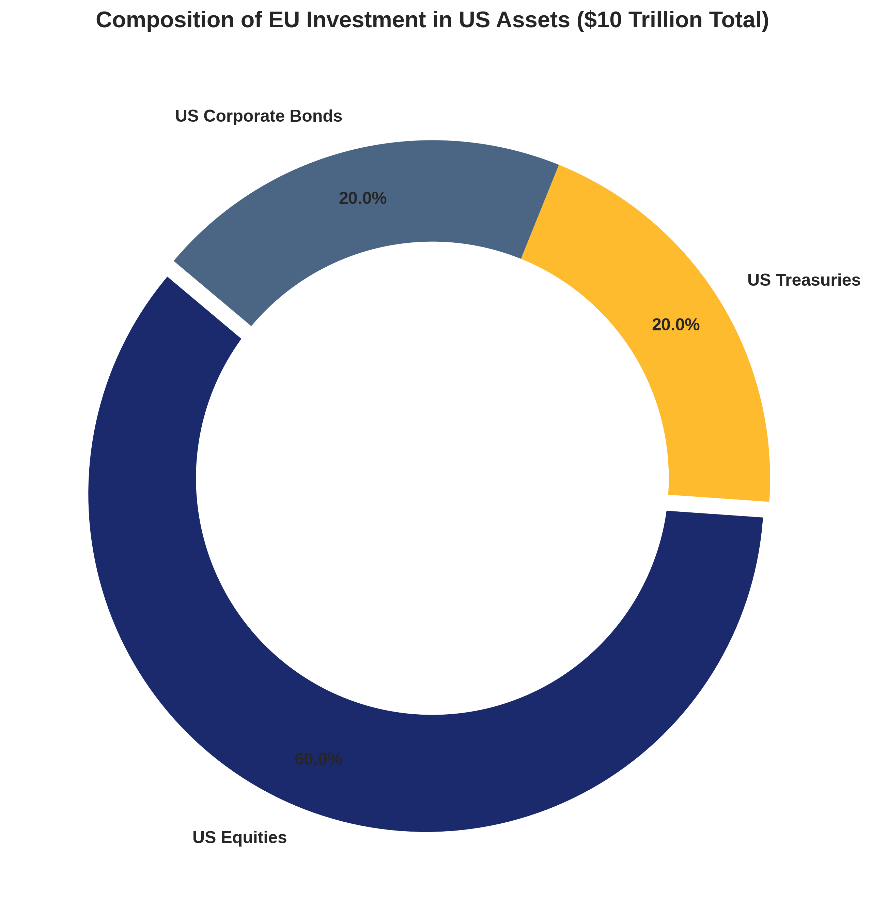
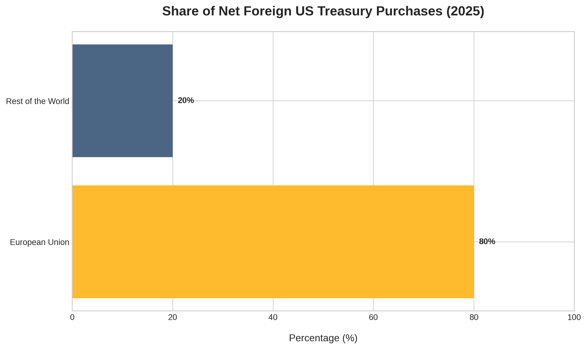
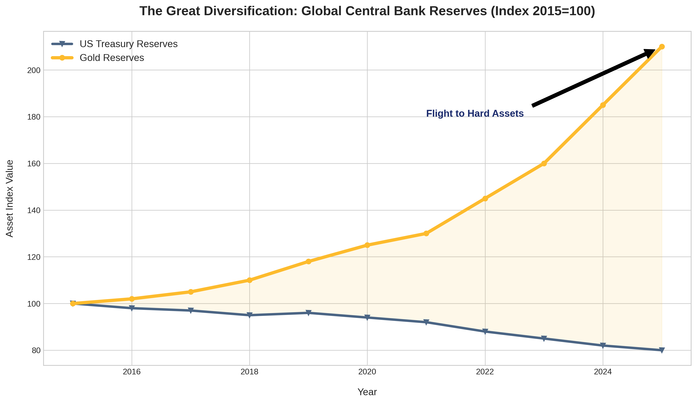

# The Global Financial Reset: The West's $28 Trillion Fragility

> **TL;DR:** The US is running on a massive $28 trillion asset deficit, making it dangerously dependent on foreign capital. While powers like China and Japan are backing away, the EU has become the "last man standing" supporting the US Treasury market. This gives Europe unprecedented leverage - a single shift in their buying pattern could send US interest rates soaring and trigger a global financial restructuring.

---

## 1. The $28 Trillion Trap
The US financial system rests on a staggering imbalance. Currently, foreign entities own **$68.9 trillion** in US assets, while the US only holds **$41 trillion** abroad. This **$28 trillion gap** - roughly the size of the entire US economy - represents a massive dependency on foreign "goodwill."

For decades, this inflow of capital allowed the US to overspend at a low cost. Today, that luxury has turned into a vulnerability.

## 2. Europe: The Last Pillar Standing
While historic partners like China, Russia, and Saudi Arabia have spent the last decade reducing their US Treasury exposure, the European Union has moved in the opposite direction. 

Europe is now the primary financier of the US deficit. The EU holds:
*   **$2 Trillion** in US Treasuries
*   **$2 Trillion** in Corporate Bonds
*   **$6 Trillion** in US Equities

## 3. The 2026 Refinancing Wall
The fragility of this setup will be tested in **2026**, when a record **$8 trillion** of US debt must be refinanced. This represents **25% of US GDP** that needs to be "re-sold" to investors just to keep the lights on.

In 2025, Europe accounted for **80% of all foreign US Treasury buying**. If Europe simply *stops* buying - not even sells, just pauses - the US faces a massive demand vacuum.

## 4. The Leverage Effect
A sudden pull-back by the EU would force US interest rates up to attract new buyers. Estimates suggest that if the EU sold just 20% of its holdings, yields could jump by **1%**. This would immediately hike mortgage rates, corporate debt costs, and consumer credit, stalling the US economy.

## 5. The Flight to Hard Assets
We are already seeing the market prepare for this uncertainty. As central banks realize that debt can be used as a political weapon (e.g., freezing assets), they are diversifying. Over the last decade, Treasury holdings have steadily declined in favor of **Gold**.

---

## Conclusion: A Systemic Shift
The era of "passive" foreign investment is over. Capital has become a tool of leverage and strategic autonomy. For the US, the risk is no longer just about inflation or growth; it's about the stability of the buyer base. As the world migrates toward assets that cannot be frozen or debased, the $28 trillion gap stands as the most significant pressure point in the global financial system.
