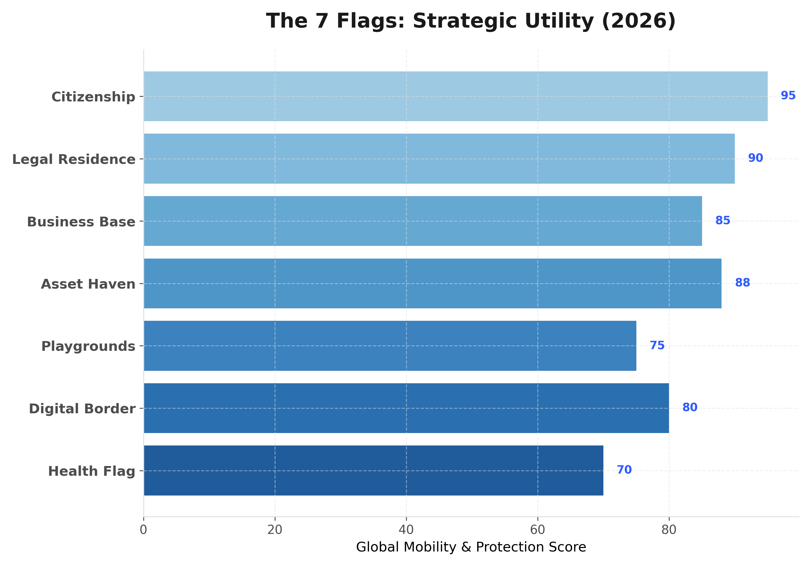
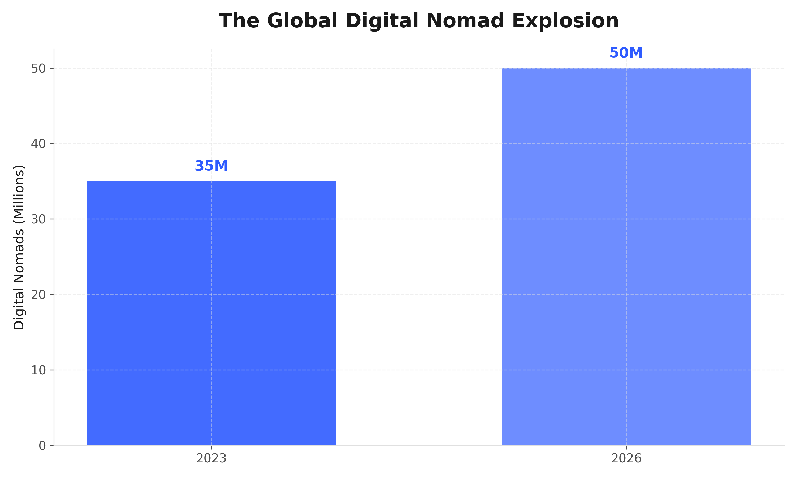
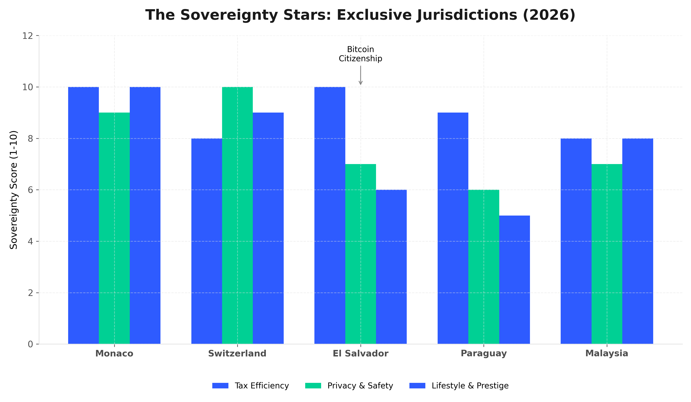
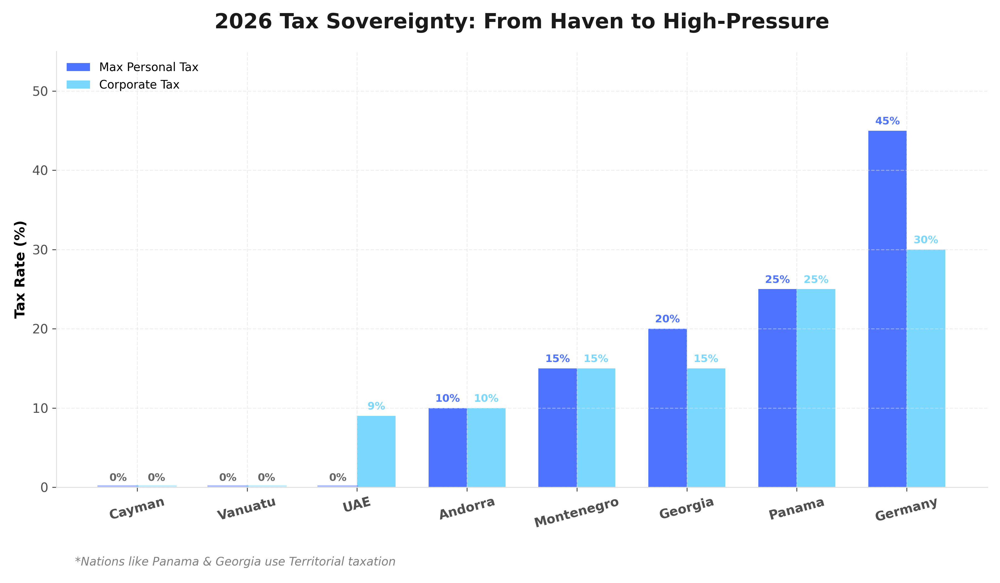

## The Modern Blueprint for Freedom: Understanding Flag Theory in 2026

### TL;DR

Flag Theory is a strategic framework for **diversifying your life across multiple countries** to maximize personal freedom and financial security. By "planting flags" (citizenship, residency, business, etc.) in different jurisdictions, you ensure that no single government has total control over your wealth or mobility. In 2026, with over **50 million digital nomads** worldwide and increasing geopolitical volatility, this strategy has evolved from a "billionaire's secret" to a practical necessity for the global middle class.

---

## What is Flag Theory?

Originally conceived in the 1960s by investment Harry Schultz as a "Three Flag" strategy, the concept was later expanded into the **Five Flag Theory**. The core principle is simple: **"Go where you are treated best."**

By unbundling your life, you treat different countries as service providers. You might choose one for its safety, another for its low taxes, and a third for its high-interest banking.

### The Seven Flags of Sovereignty

In the digital age, the classic five flags have expanded to seven, adding layers for digital privacy and health security. Each flag serves as a pillar of protection.

1. **Passport & Citizenship:** Ideally from a country that doesn't tax income earned abroad (e.g., St. Kitts, Turkey, or Vanuatu).
2. **Legal Residence:** A "tax haven" or a country with territorial taxation where you actually live (e.g., Dubai, Panama, or Portugal).
3. **Business Base:** Where you incorporate your company to benefit from low corporate tax and less bureaucracy (e.g., Singapore, Estonia, or BVI).
4. **Asset Haven:** Where you keep your money—stable banks with strong privacy (e.g., Switzerland or Liechtenstein).
5. **Playgrounds:** Countries where you spend your time and money, enjoying a high quality of life.
6. **The Digital Flag:** Decentralized storage and VPNs to ensure data privacy.
7. **The Health Flag:** Residency in countries with world-class, affordable healthcare (e.g., Malaysia or Costa Rica).

---

## Why It Matters More Than Ever in 2026

### 1. The Digital Nomad Explosion

As of 2026, the number of digital nomads has soared past **50 million**. The ability to legally optimize taxes through "geo-arbitrage" is now a standard financial move for the global talent pool.

### 2. The Sovereignty Stars: Exclusive Jurisdictions

Beyond basic nomad visas, a tier of "Sovereignty Stars" has emerged. These nations offer unique combinations of tax efficiency, privacy, and lifestyle prestige.

*   **Monaco**: The ultimate 0% tax haven with high entry barriers but unmatched prestige.
*   **El Salvador**: A pioneer in "Bitcoin Citizenship," offering 0% tax on foreign income and crypto assets.
*   **Switzerland**: Offers "Lump-Sum Taxation" for the wealthy, decoupling tax from income.
*   **Paraguay**: An accessible territorial tax system with minimal stay requirements.

### 3. Tax Sovereignty & Economic Fragility

In an era of "geopolitical recalibration," holding assets in jurisdictions with high tax pressure is a risk. Strategic hubs ranging from 0% havens like the Cayman Islands and Vanuatu to territorial systems like Panama and Georgia offer a wide spectrum of tax efficiency.

---

## Conclusion: Designing Your Sovereignty

Flag Theory is not about "escaping" society; it is about **international diversification**. In 2026, the world is more connected yet more regulated than ever. By strategically planting your flags, you stop being a "subject" of one nation and start being a "customer" of many. Whether you are a freelance developer or a startup founder, the goal remains the same: to build a life of intention where your freedom isn't at the mercy of a single government's whim.
