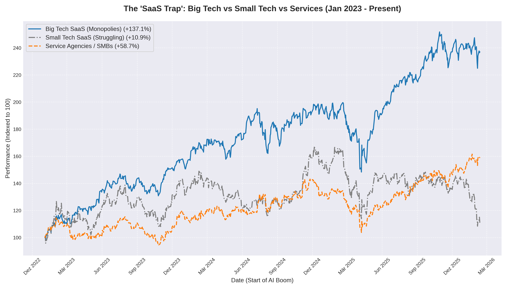

# The SaaS Trap & The Economic Split: Why Even Software Won't Save You.

There is a massive misconception in the B2B market right now: **That "building software" is the escape hatch for agencies.**

The data tells a much more brutal story. We aren't just in a K-Shaped recovery; we are in a **"Platform Monopoly"** trap. 

Since 2023, the market has split into three distinct fates:
1.  **The Monopolists (Big Tech SaaS):** The giants (XLK +137%) are capturing almost all the liquidity and data.
2.  **The Squeezed (Service Agencies):** SMBs and agencies (IWM +58%) are struggling as acquisition costs rise and budgets freeze.
3.  **The Trap (Small/Mid Tech SaaS):** Average cloud companies (WCLD +10%) are actually performing **worse** than traditional services.

**Why is this happening?**
B2B acquisition has become brutally hard because the value proposition of "we do it for you" is losing to "this AI does it for $50/mo." 

But here comes the twist — even **Small SaaS** companies are being squeezed from both sides. They lack the distribution power of Big Tech (who simply copy successful features) and the high-touch relationships of agencies. 

Meanwhile, agencies are being defunded by clients who hope SaaS will replace them — only for that capital to be absorbed by the Platform Monopolies.

**The Lesson:**
It’s no longer enough to just "have a SaaS" or "run an agency." 
If you aren't building on top of a platform you own, or creating a niche so deep that AI can't map it, you are being liquidated by the giants.

The middle is disappearing. You either become a platform, or you become a commodity.

**The systemic risk?** If this concentration continues, we reach a point where capital merely accumulates at the top, and the economy stops circulating for everyone else.

