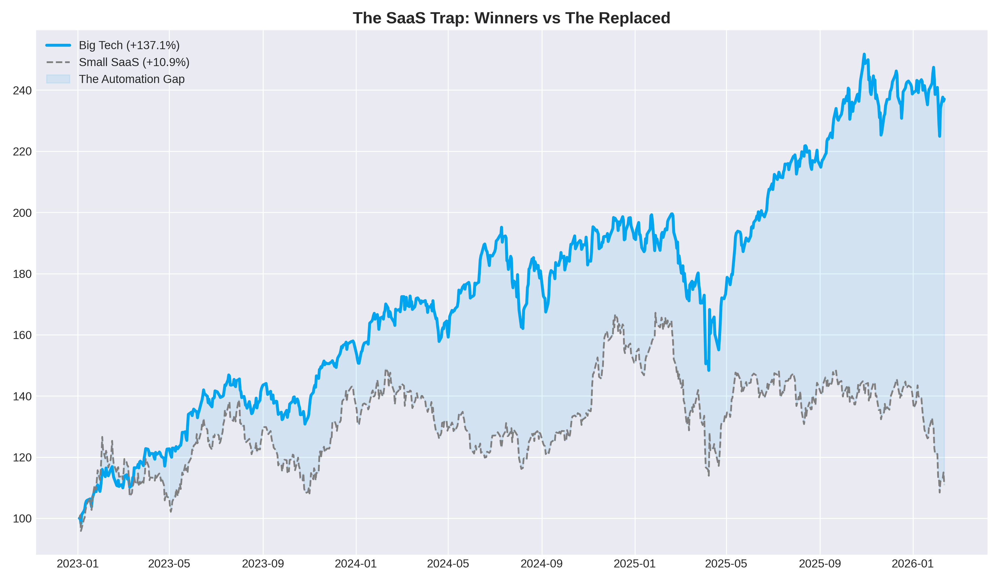
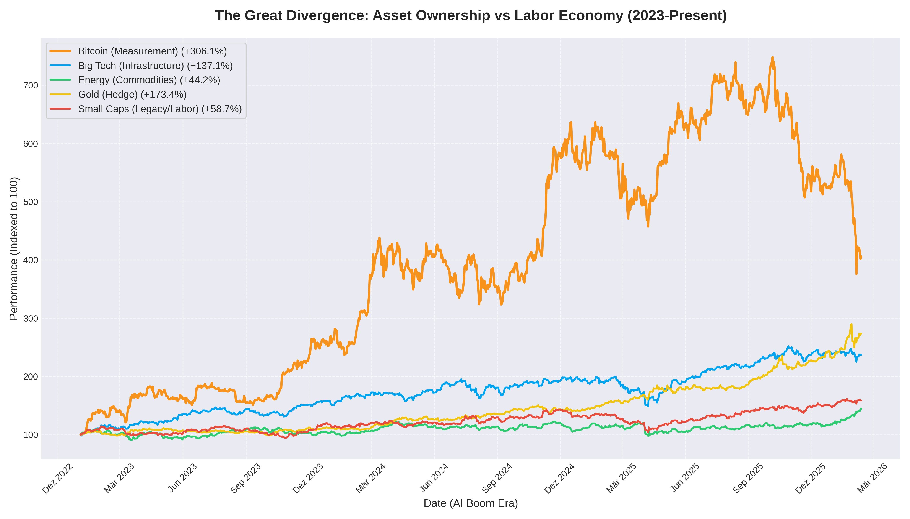
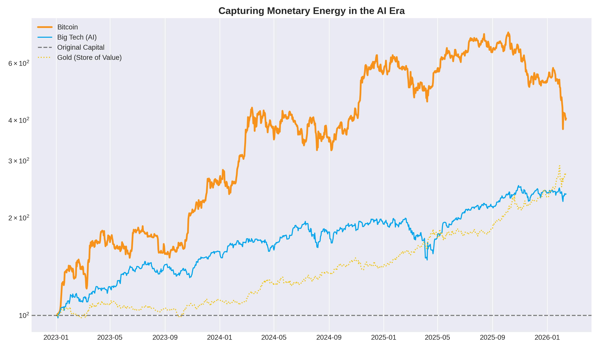

# How to Survive the K-Shape Economy Future

## The AI Automation Dilemma

In the era of artificial intelligence, the traditional economic paradigm is shifting at an unprecedented pace. Everything that can be automated, will be. From manual labor to complex SaaS operations and small creative agencies, the "middle" is being hollowed out. 

> "Robots and computers will own any clearly bounded job, skill or game. Humans should focus on creative work... If they can train you to do it, then eventually they will train a computer to do it."
> — **Naval Ravikant**

Unless you possess a hyper-niche that AI cannot easily replicate, the pressure of automation is a ticking clock. This is the core of the **K-Shaped Economy**: a divergence where the owners of infrastructure and capital ascend, while those reliant on labor and outdated business models are left behind.

Even in the technology sector, a sub-K-shape is forming. We call it the **SaaS Trap**.

While Big Tech (the infrastructure providers) captures the gains of automation, smaller SaaS companies and agencies are struggling to maintain margins as the "marginal cost of intelligence" drops toward zero.

> "AI won't replace humans. But humans who use AI will replace those who don't."
> — **Sam Altman**

## From Labor to Ownership

The future is not about work; it is about **ownership**. As the financial sector paradoxically grows in response to this dilemma, the only way to safeguard your future—and that of your children—is to accumulate assets that survive this transition.

### Assets That Survive

To survive and thrive, you must own pieces of the infrastructure of the future. 

*   **Bitcoin**: The ultimate measurement instrument for the financial system. 
*   **Revenue-Sharing Protocols**: Ownership in the automated profit streams of the future.
*   **Major Infrastructure Equity**: Ownership in the companies building the world's AI hardware and energy grids.

The goal is to capture "Monetary Energy" before it is debased by the system's need to print money to patch over the labor dilemma.

> "In the presence of rampant inflation, cash & credit become crumbling liabilities. Convert your balance sheet to #bitcoin to turn liabilities into assets."
> — **Michael Saylor**

## The Strategy: Accumulation in a Tightening Market

How do you accumulate these assets when the market is becoming increasingly hostile for Small and Medium Businesses (SMBs)?

1.  **Invest Early and Often**: Do not wait. Benefit from the compounding value of scarce assets.
2.  **Work for the Non-Replaced... for Now**: Pivot labor earnings immediately into ownership assets. 
3.  **Join the Infrastructure Giants**: Move from *employee* to *equity holder* as quickly as possible.
4.  **Identify Meaningful Protocols**: 99% of crypto will die. Identify the 1% that solves real-world issues.

## Conclusion

The K-Shape is not a warning; it is our current reality. In the automated future, your labor is a depreciating asset. Your ownership is your only true security.
